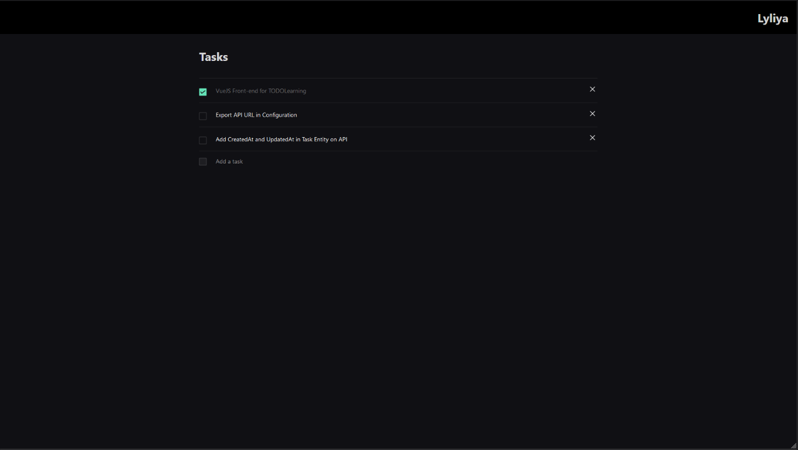
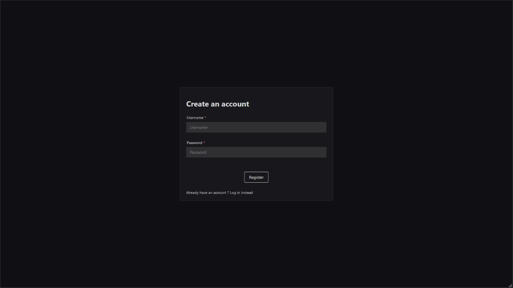

# vuejs-todolearning

This is a series of project to learn Front-end framework (Web and mobile) and back-end architecture (Typescript, Express, TypeORM).  
The goal is to create a Todo app in those languages

This repository is the **VueJS** one, you can find the main one [here](https://github.com/Lyliya/TODOLearning)

This project use VueJS 3, NaiveUI and vIcons




---

Make sure to host the API locally in order to use the front

## Project setup
```
npm install
```

### Compiles and hot-reloads for development
```
npm run serve
```

### Compiles and minifies for production
```
npm run build
```

### Lints and fixes files
```
npm run lint
```

